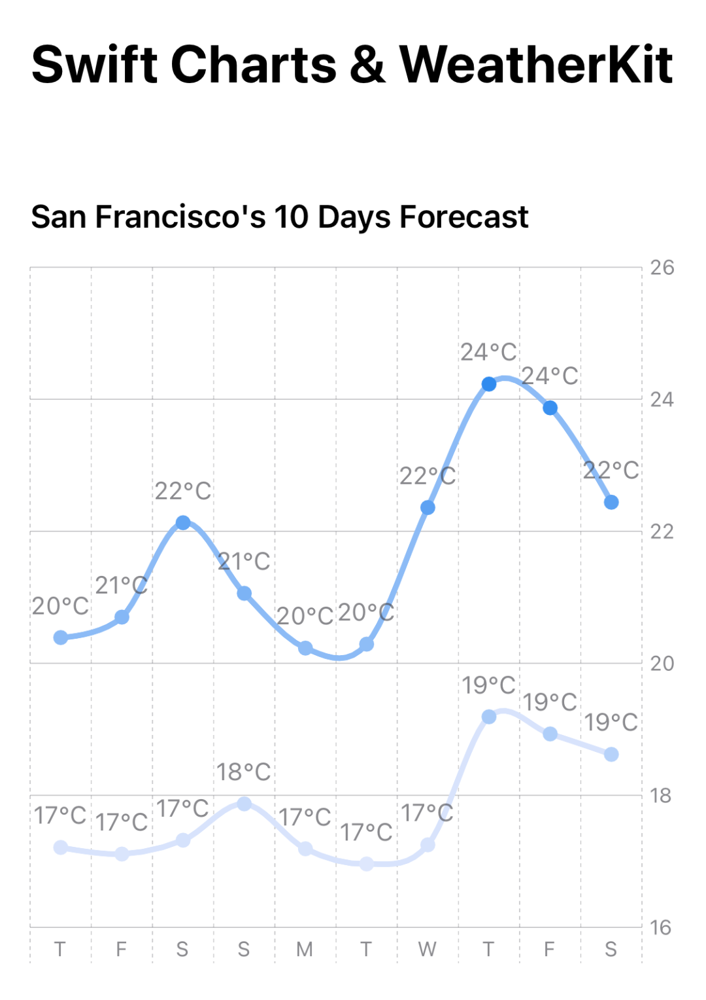

# Swift Charts & WeatherKit

Swift Charts make it easy to build highly customizable charts, in < 100 LOC, I was able to build a high and low chart for the next 10 days forecast with the Help of WeatherKit.

## New APIs Used

* Swift Charts.
* WeatherKit. (Note: you need to active WeatherKit with your own developer account).

## DubDub Series.
This is a submission for [DubDubSeries](https://github.com/SwiftUI-Series/DubDubSeries)

